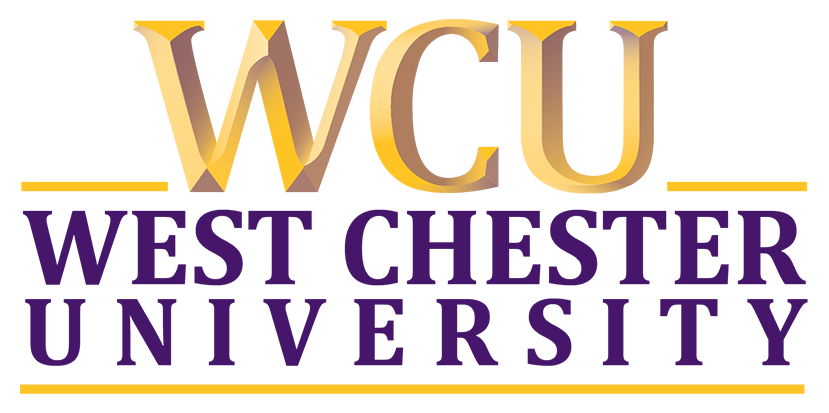

# Hi :wave:

## About Me

I'm Ciaran - I like to work on passion projects and explore open source projects. I'm interested in software engineering and physics and try to find an intersection between the two when I can.

**Education:**
| | | | |
|:--:|:--:|:--:|:--:|
| </img> | [Columbia University](https://www.columbia.edu/) | B.S. in Computer Science | 2022-2024 |
| </img> | [West Chester University](https://www.wcupa.edu/) |  B.S. in Physics | 2020-2022 |

**Projects:** 

Feel free to explore my GitHub repositories to discover the projects I've been working on. If you have any ideas or want to collaborate on something cool, don't hesitate to reach out! Let's build something together.
